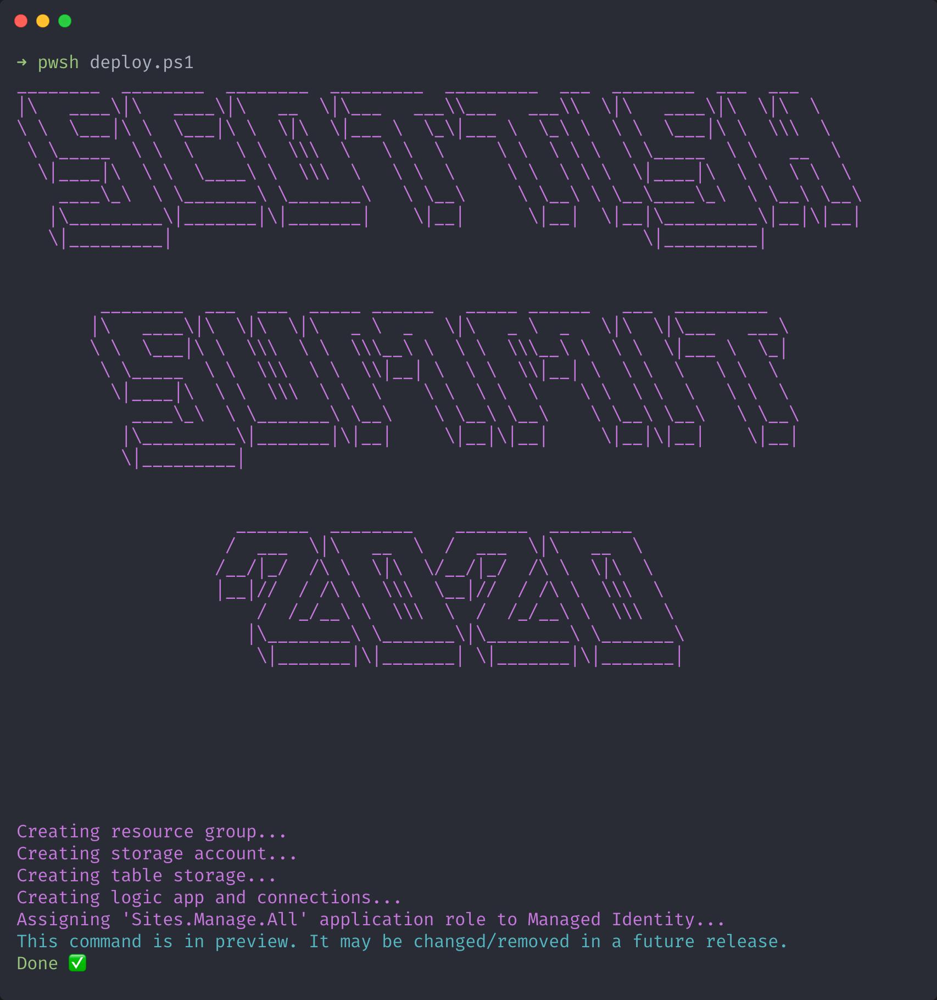

# SharePoint Online Webhook Logic App

This repository contains a sample Logic App that can used as a SharePoint Webhook, it was demonstrated at [Scottish Summit 2020](https://www.scottishsummit.com) in the session, `Modernise and scale your SharePoint events with Webhooks`.

## Pre-requisities

- [Azure CLI](https://docs.microsoft.com/en-us/cli/azure/?view=azure-cli-latest)
- [Office 365 CLI](https://pnp.github.io/office365-cli)
- [PowerShell](https://docs.microsoft.com/en-us/powershell/scripting/overview?view=powershell-7)

## Deployment

- Login to Azure CLI, `az login`
- Login to Office 365 CLI, `o365 login`
- Create copy of `deploy.template.json` 
- Rename copy to `deploy.json`
- Update placeholder values in `deploy.json`
- Execute `deploy.ps1`

## Post Deployment

- Create SharePoint site
- Create a Custom List
- Execute `./scripts/get-logicappurl.ps1 -resourcegroupname resource -logicappname logicappname`
- Take a note of the URL this is the `notificationurl` for the next script
- Execute `./scripts/add-webhook.ps1 -weburl https://contoso.sharepoint.com/sites/webhook -clientstate webhook -notificationurl "https://logicappurl" -listtitle Webhook`

Congratulations! You have succesfully registered a webhook against a SharePoint list.

Now go create some events 🚀🎉